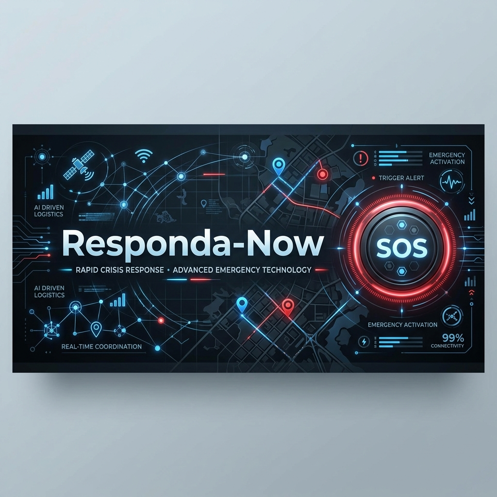

# Responda-Now: AI-Powered Crisis Response Ecosystem



## 🌐 Deployed Link
**Experience the platform live at:** [https://gen-lang-client-0538823565.web.app/](https://gen-lang-client-0538823565.web.app/)

---

## 🚀 Overview
**Responda-Now** is a state-of-the-art crisis management and emergency response platform built for the **Google AI Solution Challenge**. It bridges the gap between individuals in distress, local volunteers, and administrative authorities using real-time data synchronization and AI-driven insights.

The platform provides a unified interface for tracking emergencies, allocating resources, and visualizing crisis zones in real-time, ensuring that help reaches those who need it most, as fast as possible.

## ✨ Key Features

### 🚨 For Users (Citizens)
- **Instant SOS Trigger**: A high-impact, one-tap emergency button that immediately broadcasts location and status to responders.
- **Active Incident Tracking**: Real-time updates on the status of your emergency request.
- **AI Predictive Chatbot**: Get immediate guidance on first-aid and safety measures while waiting for responders.

### 🤝 For Volunteers (First Responders)
- **Live Crisis Map**: Interactive map showing all active incidents in the vicinity with priority levels.
- **Response Management**: Claim incidents, update status, and coordinate with other volunteers in real-time.
- **Incident Timeline**: Comprehensive logs of response actions for better situational awareness.

### 📊 For Admins (Command Center)
- **System-Wide Analytics**: Data-driven insights into incident trends, response times, and resource distribution.
- **Resource Allocation**: Oversee volunteer activity and manage large-scale crisis zones.
- **Predictive Intelligence**: Identify potential hotspots and optimize standby locations for responders.

## 🛠️ Technology Stack

- **Frontend**: [React](https://reactjs.org/) + [Vite](https://vitejs.dev/) + [TypeScript](https://www.typescriptlang.org/)
- **Styling**: [Tailwind CSS](https://tailwindcss.com/) + [Shadcn UI](https://ui.shadcn.com/)
- **Animations**: [Framer Motion](https://www.framer.com/motion/)
- **Backend/Database**: [Firebase](https://firebase.google.com/) (Auth, Firestore, Analytics, Data Connect)
- **Mapping**: [Leaflet](https://leafletjs.com/) + [React Leaflet](https://react-leaflet.js.org/)
- **Data Visualization**: [Recharts](https://recharts.org/)
- **State Management**: [TanStack Query](https://tanstack.com/query/latest)

## 🏗️ Project Structure

```text
src/
├── components/
│   ├── responda/          # Core business logic components
│   │   ├── sos/           # SOS specific UI elements
│   │   ├── CrisisMap.tsx  # Leaflet integration
│   │   └── ...            # Dashboards for User, Volunteer, Admin
│   └── ui/                # Reusable Shadcn UI components
├── hooks/                 # Custom React hooks
├── lib/                   # External library configurations (Firebase, etc.)
├── pages/                 # Main application routes
└── integrations/          # External API/Service integrations
```

## ⚙️ Getting Started

### Prerequisites
- Node.js (v18+)
- npm or bun

### Installation

1. **Clone the repository:**
   ```bash
   git clone <repository-url>
   cd responda-now
   ```

2. **Install dependencies:**
   ```bash
   npm install
   # or
   bun install
   ```

3. **Set up Environment Variables:**
   Create a `.env` file in the root directory and add your Firebase credentials:
   ```env
   VITE_FIREBASE_API_KEY=your_api_key
   VITE_FIREBASE_AUTH_DOMAIN=your_auth_domain
   VITE_FIREBASE_PROJECT_ID=your_project_id
   VITE_FIREBASE_STORAGE_BUCKET=your_storage_bucket
   VITE_FIREBASE_MESSAGING_SENDER_ID=your_sender_id
   VITE_FIREBASE_APP_ID=your_app_id
   VITE_FIREBASE_MEASUREMENT_ID=your_measurement_id
   ```

4. **Run the development server:**
   ```bash
   npm run dev
   ```


## 🌍 Acknowledgements
- **Google AI Solution Challenge** for the inspiration and platform.
- **Leaflet** for the incredible mapping capabilities.
- **Firebase** for providing the real-time backbone.

---
*Built with ❤️ for a safer tomorrow.*
